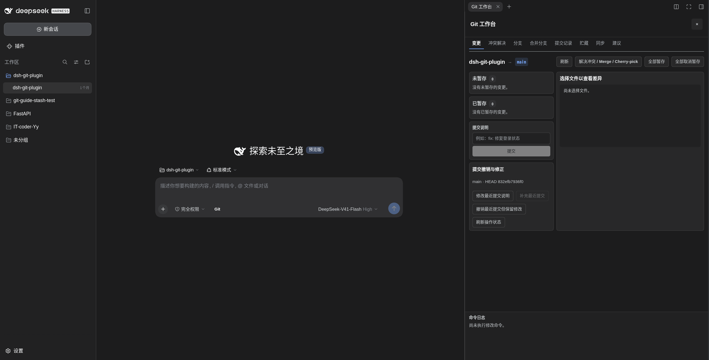

<div align="center">

# DSH Git Plugin

**面向 DeepSeek Harness Web 的可视化 Git 工作台：查看仓库、执行常用操作，并安全运行 AI 生成的 Git 工作流。**


[](https://www.npmjs.com/package/dsh-easygit-plugin)
[](https://github.com/IT-coder-Yy/dsh-git-plugin)
[](LICENSE)

[English](README.md) · 简体中文

</div>

## 怎么用

<p align="center">
  <strong>👀 查看 Git 状态 &nbsp;→&nbsp; 🖱️ 点击快捷操作或询问 Agent &nbsp;→&nbsp; ✅ 检查确认 &nbsp;→&nbsp; 🚀 执行</strong>
</p>

## 效果预览



## 功能

1. **可视化仓库状态**：查看当前分支、已暂存和未暂存文件，并查看每个文件的格式化审阅视图或原始 Diff。
2. **提交记录与详情**：通过提交图浏览当前分支历史；点击提交即可查看提交说明、作者、时间、父提交、变更文件、增删统计和完整 Diff。
3. **点击执行 Git 操作**：直接暂存或取消暂存单个/全部文件、创建提交，以及新建、搜索、切换或安全删除本地分支。
4. **集中查看引用**：无需离开 DeepSeek Harness Web，即可查看本地分支、远程分支和标签。
5. **自然语言工作流**：将自然语言请求转换成清晰、分步骤的 Git 命令提议，然后直接执行或复制到终端手动执行。
6. **默认安全**：使用保守的命令白名单、高风险操作确认、防重复执行和诊断信息脱敏机制。

## 快速开始

### 0. 允许立即安装新发布的包

较新版本的 `pnpm` 可能延迟安装刚发布的包。若要立即安装最新版本，请在 `~/.dsh/profiles/web/pnpm-workspace.yaml` 中加入：

```yaml
minimumReleaseAgeExclude:
  - dsh-easygit-plugin
```

### 1. 安装插件

```sh
dsh plugin --profile web add dsh-easygit-plugin
```

### 2. 启动 DSH Web

```sh
dsh web
```

### 3. 打开 Git 工作台

点击输入框旁的 Git 按钮，即可查看变更和提交记录，也可以点击暂存文件、创建提交或管理分支。

遇到更复杂的工作流时，可以用自然语言告诉 Agent。例如：

```text
将文档更新提交到当前分支，提交信息为 "docs: update guide"
```

在 Git 工作台中检查生成的步骤，然后选择直接执行或手动执行。

## 从源码安装

```sh
git clone https://github.com/IT-coder-Yy/dsh-git-plugin.git
cd dsh-git-plugin
npm install
npm run build
dsh plugin --profile web add ${PWD}
```

## 从 GitHub 仓库安装

```sh
dsh plugin --profile web add github:IT-coder-Yy/dsh-git-plugin
```

## 更新插件

```sh
dsh plugin --profile web update dsh-easygit-plugin
```

## 卸载插件

```sh
dsh plugin --profile web remove dsh-easygit-plugin
```

## 工作原理

插件注册两个模型工具：

| 工具 | 说明 |
| --- | --- |
| `git_repo_state` | 只读获取当前仓库状态。 |
| `git_propose` | 校验并登记一个或多个 Git 操作步骤。 |

Web profile 会在输入框旁添加 Git 操作入口，并在原生详情区域打开工作台。工作台通过多个标签页集中展示工作区变更与 Diff、分支与引用、提交记录与详情、贮藏，以及 Agent 生成的操作提议。命令会在创建提议时和实际执行前分别进行校验。

## 安全说明

- 每个步骤只能包含一条允许的 `git <子命令> ...` 命令。
- 禁止 shell 控制符、命令替换、重定向、可执行 hook 和不安全的 Git 选项。
- 高风险操作必须显式确认，每个提议只能执行一次。
- 插件遵循 DeepSeek Harness 提供的 Shell 和沙箱策略；请仅在可信仓库和可信 Git 配置中使用。

如需报告安全漏洞，请按照 [SECURITY.md](SECURITY.md) 中的方式私下联系。

## 兼容性

最后于 **2026-08-16** 使用 DeepSeek Harness `0.1.0-rc.6` 和 dsh-easygit-plugin `0.2.1` 完成验证。验证范围包括完整项目检查（59 项测试）、构建产物可重复性、DSH Web 启动，以及插件 `/easygit` Host 路由成功响应。

## 开发

需要 Node.js `^22.19.0 || >=24.0.0`、Git，以及支持静态 Cordis 插件的 DeepSeek Harness 开发者预览版本。

```sh
npm install
npm run check
npm pack --dry-run --ignore-scripts
```

## 许可证

[MIT](LICENSE)
