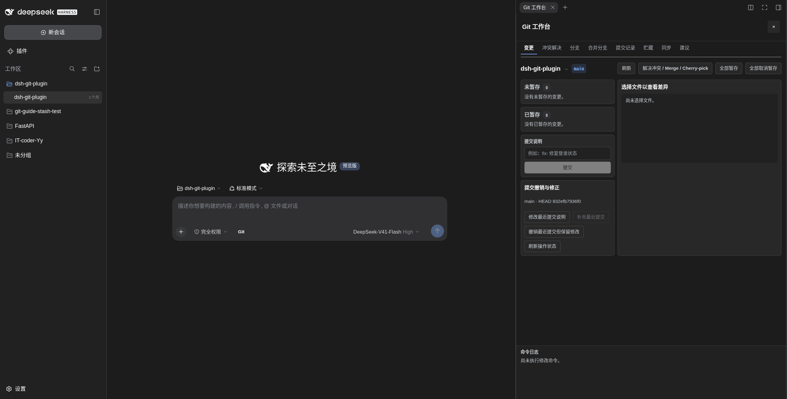

<div align="center">

# DSH Git Plugin

**看得清 Git 历史与变更，点几下就能完成日常 Git 操作。**

集成在 DeepSeek Harness Web 中的可视化 Git 工作台。


[](https://www.npmjs.com/package/dsh-easygit-plugin)
[](https://github.com/IT-coder-Yy/dsh-git-plugin)
[](LICENSE)
[](https://linux.do)

[English](README.md) · 简体中文

</div>

## 效果预览



## Git 可视化，操作更简单

**仓库情况，一眼看清。** 用提交图浏览历史，点击查看提交详情与文件 Diff，对比已暂存和未暂存改动，在同一工作台掌握分支、标签、贮藏与远程同步状态。

**日常操作，点击完成。** 暂存、提交、切换分支、合并、贮藏、拉取和推送都可直接在界面操作。合并前先预览改动，遇到冲突用内置三方编辑器处理。

| 功能区 | 可以做什么 |
| --- | --- |
| 变更 | 查看格式化审阅或原始 Diff；暂存、取消暂存单个或全部文件；点击「AI 生成」用当前会话模型结合暂存差异和项目背景填写约定式提交说明，编辑后提交。 |
| 提交记录 | 浏览提交图、说明、父提交、变更文件及 Diff；修改、撤销或 Revert 提交。 |
| 分支 | 搜索、新建、切换和删除本地分支；查看远程分支与标签。 |
| 合并分支 | 预览待引入提交与文件改动；选择普通合并、仅快进或压缩合并。 |
| 冲突解决 | 对照当前方、传入方与结果；逐块选择一方、保留双方或手动编辑；保存、标记解决并继续。 |
| 贮藏 | 贮藏全部或指定文件，按需包含未跟踪文件；审阅、应用、弹出、删除或从贮藏创建分支。 |
| 同步 | 查看上游和领先/落后数量；获取更新、仅快进拉取、推送、设置上游，以及管理 Rebase。 |

复杂流程可以在 **建议** 页与独立 Git 助手对话。助手继承并增量接收主会话背景，模型设置可独立调整；生成的 Git 命令经你确认后执行，执行结果反馈给助手。仓库变化后，过期建议会被拒绝。操作失败时保留命令输出和仓库诊断，方便修正或交由 Agent 分析。

## 快速开始

需要 Git、Node.js `^22.19.0 || >=24.0.0` 和 DeepSeek Harness Web。

```sh
npm install -g @deepseek-ai/dsh@0.2.0-rc.2
dsh plugin --profile web add dsh-easygit-plugin@0.4.3
dsh web
```

打开 Git 仓库对应的会话，点击输入框旁的 **Git** 按钮，即可在原生右侧标签页中打开工作台。

日常提交只需：**变更 → 审阅 Diff → 暂存文件 → 填写说明 → 提交 → 同步 → 推送**。新分支可以在推送时设置上游。

如果 pnpm 因包刚发布而暂缓安装，可在 `~/.dsh/profiles/web/pnpm-workspace.yaml` 的现有配置中加入：

```yaml
minimumReleaseAgeExclude:
  - dsh-easygit-plugin
```

## 常用工作流

### 修改、撤销与 Revert 提交

在 **变更 → 提交撤销与修正** 中操作最近提交，或在 **提交记录** 中点击具体提交。

- **修改最近提交说明**：只修改说明，保留暂存区与工作区改动。
- **补充最近提交**：将全部已暂存改动加入最近提交，保留原说明。
- **撤销最近提交但保留修改**：通过 `reset --soft` 退回第一父提交；根提交不支持此操作。
- **Revert 此提交**：创建反向提交，要求工作区与暂存区干净。合并提交需选择主线父提交；发生冲突后可在“冲突解决”中继续、中止或跳过。

这些操作均需确认。修改与撤销最近提交会改写本地历史，可能影响已推送提交；插件不会自动强制推送。分支、HEAD 或暂存区在读取后变化时，需刷新后重新确认。

### 预览并合并分支

打开 **合并分支**，选择本地或已获取的远程分支，先预览待引入提交与文件改动，再选择普通合并、仅快进或压缩合并。压缩合并先生成暂存结果，再由你完成为一个提交。

合并要求工作区干净。远程源使用本地已获取的引用，需要最新数据时先获取更新。预览展示源分支相对共同祖先的改动，不预判冲突，也不等于最终合并结果；分支变化后需重新预览。尚未完成的普通或压缩合并可以中止，已完成的合并不能通过中止撤销。

### 可视化解决冲突

在 **冲突解决** 中对照当前方、传入方与可编辑结果，结合行号和提交引用逐块选择一方、保留双方或手动修改，然后 **保存 → 标记解决 → 继续**。Merge、Rebase、Cherry-pick 与 Revert 共用这一流程；中止与支持的跳过操作需确认。

Rebase 中，当前方是目标分支及已重放提交，传入方是正在重放的提交。未清除的冲突标记会阻止解决，文件变化会使旧快照失效。二进制冲突支持整方选择；文本编辑每个版本最多支持 48 KiB。更大文件、符号链接与子模块请使用外部工具处理。未保存草稿仅在当前页面保留，刷新后不会恢复。

### 用 Stash 暂存手头工作

在 **贮藏** 页选择全部或指定文件，按需包含未跟踪文件；按文件贮藏会保留其他文件的改动。恢复前可以先审阅内容：**应用** 保留贮藏，**弹出** 仅在恢复成功后删除贮藏。发生冲突时保留贮藏并提供冲突解决入口。从贮藏创建分支要求工作区干净，新分支从贮藏原始提交开始。

## 更新、卸载与源码安装

```sh
# 更新 / 卸载
dsh plugin --profile web update dsh-easygit-plugin
dsh plugin --profile web remove dsh-easygit-plugin
```

更新后重启 Harness 后端并刷新浏览器，确保 Host 和 Client 均加载新版本。

```sh
# 从源码安装
git clone https://github.com/IT-coder-Yy/dsh-git-plugin.git
cd dsh-git-plugin
npm install
npm run build
dsh plugin --profile web add "${PWD}"
```

也可直接从仓库安装：`dsh plugin --profile web add github:IT-coder-Yy/dsh-git-plugin`。

## 兼容性

| DSH 版本 | 真实服务冒烟测试 | 工作目录读取 |
| --- | --- | --- |
| `0.2.0-rc.1` | 通过 | 原有会话目录 |
| `0.2.0-rc.2` | 通过 | 原有会话目录 |
| `0.2.1-alpha.1` | 通过 | 原有会话目录 |
| `0.2.1-alpha.2` | 通过 | 当前工作目录，支持切换 worktree |

## 开发

```sh
npm install
npm run check
npm pack --dry-run --ignore-scripts
```

`npm run check` 执行类型检查、测试与构建一致性检查。Git 集成测试会创建临时仓库，验证仓库操作与失败恢复场景。

CI 另对上表四个 DSH 版本运行 `npm run test:dsh`。本地复现单个版本：

```sh
npm install --prefix /tmp/easygit-dsh-check @deepseek-ai/dsh@0.2.1-alpha.2
DSH_INSTALL_DIR=/tmp/easygit-dsh-check npm run test:dsh
```

测试使用临时 DSH_HOME 和 Git 仓库，结束后清理，不读取现有会话或调用模型。

## 许可证

[MIT](LICENSE)
